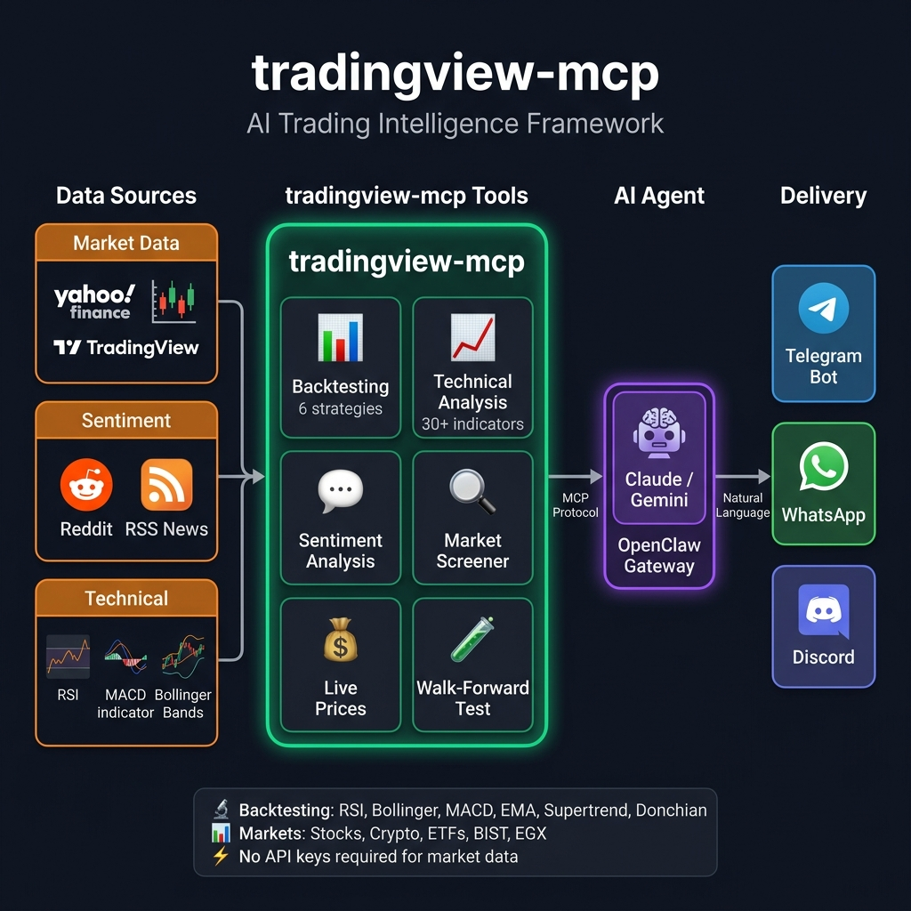

# 📈 AI Trading Intelligence Framework — MCP Server

<a href="https://trendshift.io/repositories/25110" target="_blank"></a>

**The most complete AI-powered trading toolkit for Claude and MCP clients.**
Backtesting + Live Sentiment + Yahoo Finance + 30+ Technical Analysis Tools — all in one MCP server.

[](https://opensource.org/licenses/MIT)
[](https://www.python.org/downloads/)
[](https://modelcontextprotocol.com/)
[](https://openclaw.ai)
[](https://github.com/atilaahmettaner/tradingview-mcp/releases)
[](https://pypi.org/project/tradingview-mcp-server/)
[](https://github.com/sponsors/atilaahmettaner)

> **⭐ If this tool improves your workflow, please star the repo and consider [sponsoring](https://github.com/sponsors/atilaahmettaner) — it keeps the project alive and growing!**

<a href="https://github.com/sponsors/atilaahmettaner">
  
</a>
<a href="https://github.com/sponsors/atilaahmettaner">
  
</a>
<a href="https://github.com/sponsors/atilaahmettaner">
  
</a>

---

## 🎥 Framework Demo

https://github-production-user-asset-6210df.s3.amazonaws.com/67838093/478689497-4a605d98-43e8-49a6-8d3a-559315f6c01d.mp4

---

## 🏗️ Architecture



---

## ✨ Why tradingview-mcp?

| Feature | `tradingview-mcp` | Traditional Setups | Bloomberg Terminal |
|---------|-------------------|--------------------|--------------------|
| **Setup Time** | 5 minutes | Hours (Docker, Conda...) | Weeks (Contracts) |
| **Cost** | Free & Open Source | Variable | $30k+/year |
| **Backtesting** | ✅ 6 strategies + Sharpe | ❌ Manual scripting | ✅ Proprietary |
| **Live Sentiment** | ✅ Reddit + RSS news | ❌ Separate setup | ✅ Terminal |
| **Market Data** | ✅ Live / Real-Time | Historical / Delayed | Live |
| **API Keys** | **None required** | Multiple (OpenAI, etc.) | N/A |

---

## 🚀 Quick Start (5 Minutes)

### Install via pip
```bash
pip install tradingview-mcp-server
```

### Claude Desktop Config (`claude_desktop_config.json`)

> **Note:** On macOS, GUI apps like Claude Desktop may not have `~/.local/bin` in their PATH. Use the full path to `uvx` to avoid "command not found" errors.

```json
{
  "mcpServers": {
    "tradingview": {
      "command": "/Users/YOUR_USERNAME/.local/bin/uvx",
      "args": ["--from", "tradingview-mcp-server", "tradingview-mcp"]
    }
  }
}
```

On Linux, replace `/Users/YOUR_USERNAME` with `/home/YOUR_USERNAME`. On Windows, use `%USERPROFILE%\.local\bin\uvx.exe`.

### Or run from source
```bash
git clone https://github.com/atilaahmettaner/tradingview-mcp
cd tradingview-mcp
uv run tradingview-mcp
```

---

## 📱 Use via Telegram, WhatsApp & More (OpenClaw)

Connect this server to **Telegram, WhatsApp, Discord** and 20+ messaging platforms using [OpenClaw](https://openclaw.ai) — a self-hosted AI gateway. **Tested & verified on Hetzner VPS (Ubuntu 24.04).**

### How It Works

> OpenClaw routes Telegram messages to an AI agent. The agent uses `trading.py` — a thin Python wrapper — to call `tradingview-mcp` functions and return formatted results. **No MCP protocol needed between OpenClaw and the server; it's a direct Python import.**

```
Telegram → OpenClaw agent (AI model) → trading.py (bash) → tradingview-mcp → Yahoo Finance
```

### Quick Setup

```bash
# 1. Install UV and tradingview-mcp
curl -LsSf https://astral.sh/uv/install.sh | sh && source ~/.bashrc
uv tool install tradingview-mcp-server

# 2. Configure OpenClaw channels
cat > ~/.openclaw/openclaw.json << 'EOF'
{
  channels: {
    telegram: {
      botToken: "YOUR_BOT_TOKEN_HERE",
    },
  },
}
EOF

# 3. Configure gateway + agent
openclaw config set gateway.mode local
openclaw config set acp.defaultAgent main

# 4. Set your AI model (choose ONE option below)
openclaw configure --section model

# 5. Install the skill + tool wrapper
mkdir -p ~/.agents/skills/tradingview-mcp ~/.openclaw/tools
curl -fsSL https://raw.githubusercontent.com/atilaahmettaner/tradingview-mcp/main/openclaw/SKILL.md \
  -o ~/.agents/skills/tradingview-mcp/SKILL.md
curl -fsSL https://raw.githubusercontent.com/atilaahmettaner/tradingview-mcp/main/openclaw/trading.py \
  -o ~/.openclaw/tools/trading.py && chmod +x ~/.openclaw/tools/trading.py

# 6. Start the gateway
openclaw gateway install
systemctl --user start openclaw-gateway.service
```

### Choose Your AI Model

OpenRouter is **not required** — use whichever provider you have a key for:

| Provider | Model ID for OpenClaw | Get Key |
|----------|----------------------|---------|
| **OpenRouter** (aggregator — access to all models) | `openrouter/google/gemini-3-flash-preview` | [openrouter.ai/keys](https://openrouter.ai/keys) |
| **Anthropic** (Claude direct) | `anthropic/claude-sonnet-4-5` | [console.anthropic.com](https://console.anthropic.com) |
| **Google** (Gemini direct) | `google/gemini-2.5-flash` | [aistudio.google.com](https://aistudio.google.com) |
| **OpenAI** (GPT direct) | `openai/gpt-4o-mini` | [platform.openai.com](https://platform.openai.com) |

```bash
# Examples — set your chosen model:
openclaw config set agents.defaults.model "openrouter/google/gemini-3-flash-preview"  # via OpenRouter
openclaw config set agents.defaults.model "anthropic/claude-sonnet-4-5"               # Anthropic direct
openclaw config set agents.defaults.model "google/gemini-2.5-flash"                   # Google direct
```

> ⚠️ **Important:** Prefix must match your provider. `google/...` needs a Google API key. `openrouter/...` needs an OpenRouter key.

### ⚠️ Common Mistakes

| Symptom | Cause | Fix |
|---------|-------|-----|
| `Unrecognized keys: mcpServers` | `mcpServers` not supported in this version | Remove from config, use bash wrapper |
| `No API key for provider "google"` | Used `google/model` but only have OpenRouter key | Use `openrouter/google/model` instead |
| `which agent?` loop | `acp.defaultAgent` not set | `openclaw config set acp.defaultAgent main` |
| Gateway won't start | `gateway.mode` missing | `openclaw config set gateway.mode local` |

### Test Your Bot

Once running, send your Telegram bot:
```
market snapshot
backtest RSI strategy for AAPL, 1 year
compare all strategies for BTC-USD
```

👉 **[Full OpenClaw Setup Guide →](OPENCLAW.md)**

---


Unlike basic screeners, this framework deploys **specialized AI agents** that debate findings in real-time:

1. **🛠️ Technical Analyst** — Bollinger Bands (±3 proprietary rating), RSI, MACD
2. **🌊 Sentiment & Momentum Analyst** — Reddit community sentiment + price momentum
3. **🛡️ Risk Manager** — Volatility, drawdown risk, mean-reversion signals

*Output: `STRONG BUY` / `BUY` / `HOLD` / `SELL` / `STRONG SELL` with confidence score*

---

## 🔧 All 30+ MCP Tools

### 📊 Backtesting Engine *(New in v0.6.0)*

| Tool | Description |
|------|-------------|
| `backtest_strategy` | Backtest 1 of 6 strategies with institutional metrics (Sharpe, Calmar, Expectancy) |
| `compare_strategies` | Run all 6 strategies on same symbol and rank by performance |

**6 Strategies to Test:**
- `rsi` — RSI oversold/overbought mean reversion
- `bollinger` — Bollinger Band mean reversion
- `macd` — MACD golden/death cross
- `ema_cross` — EMA 20/50 Golden/Death Cross
- `supertrend` — ATR-based Supertrend trend following 🔥
- `donchian` — Donchian Channel breakout (Turtle Trader style)

**Metrics you get:** Win Rate, Total Return, Sharpe Ratio, Calmar Ratio, Max Drawdown, Profit Factor, Expectancy, Best/Worst Trade, vs Buy-and-Hold, with **realistic commission + slippage simulation**.

```
Example prompt: "Compare all strategies on BTC-USD for 2 years"
→ #1 Supertrend: +31.5% | Sharpe: 2.1 | WR: 62%
→ #2 Bollinger:  +18.3% | Sharpe: 3.4 | WR: 75%
→ Buy & Hold:    -5.0%
```

---

### 💰 Yahoo Finance — Real-Time Prices *(New in v0.6.0)*

| Tool | Description |
|------|-------------|
| `yahoo_price` | Real-time quote: price, change %, 52w high/low, market state |
| `market_snapshot` | Global overview: S&P500, NASDAQ, VIX, BTC, ETH, EUR/USD, SPY, GLD |

**Supports:** Stocks (AAPL, TSLA, NVDA), Crypto (BTC-USD, ETH-USD, SOL-USD), ETFs (SPY, QQQ, GLD), Indices (^GSPC, ^DJI, ^IXIC, ^VIX), FX (EURUSD=X), Turkish (THYAO.IS, SASA.IS)

---

### 🧠 AI Sentiment & Intelligence *(New in v0.5.0)*

| Tool | Description |
|------|-------------|
| `market_sentiment` | Reddit sentiment across finance communities (bullish/bearish score, top posts) |
| `financial_news` | Live RSS headlines from Reuters, CoinDesk, CoinTelegraph |
| `combined_analysis` | **Power Tool**: TradingView technicals + Reddit sentiment + live news → confluence decision |

---

### 📈 Technical Analysis Core

| Tool | Description |
|------|-------------|
| `get_technical_analysis` | Full TA: RSI, MACD, Bollinger, 23 indicators with BUY/SELL/HOLD |
| `get_multiple_analysis` | Bulk TA for multiple symbols at once |
| `get_bollinger_band_analysis` | Proprietary ±3 BB rating system |
| `get_stock_decision` | 3-layer decision engine (ranking + trade setup + quality score) |
| `screen_stocks` | Multi-exchange screener with 20+ filter criteria |
| `scan_by_signal` | Scan by signal type (oversold, trending, breakout...) |
| `get_candlestick_patterns` | 15 candlestick pattern detector |
| `get_multi_timeframe_analysis` | Weekly→Daily→4H→1H→15m alignment analysis |

---

### 🌍 Multi-Exchange Support

| Exchange | Tools |
|----------|-------|
| **Binance** | Crypto screener, all pairs |
| **KuCoin / Bybit+** | Crypto screener |
| **NASDAQ / NYSE** | US stocks (AAPL, TSLA, NVDA...) |
| **EGX (Egypt)** | `egx_market_overview`, `egx_stock_screener`, `egx_trade_plan`, `egx_fibonacci_retracement` |
| **Turkish (BIST)** | Via TradingView screener |

---

## 💬 Example AI Conversations

```
You: "Give me a full market snapshot right now"
AI: [market_snapshot] → S&P500 -3.4%, BTC +0.1%, VIX 31 (+13%), EUR/USD 1.15

You: "What is Reddit saying about NVDA?"
AI: [market_sentiment] → Strongly Bullish (0.41) | 23 posts | 18 bullish

You: "Backtest RSI strategy on BTC-USD for 2 years"
AI: [backtest_strategy] → +31.5% return | 100% win rate | 2 trades | B&H: -5%

You: "Which strategy worked best on AAPL in the last 2 years?"
AI: [compare_strategies] → Supertrend #1 (+14.6%, Sharpe 3.09), MACD last (-9.1%)

You: "Analyze TSLA with all signals: technical + sentiment + news"
AI: [combined_analysis] → BUY (Technical STRONG BUY + Bullish Reddit + Positive news)
```

---

## 💖 Support the Project

This framework is **free and open source**, built in spare time. If it saves you hours of research or helps you make better decisions, please consider sponsoring:

| Tier | Monthly | What You Get |
|------|---------|--------------|
| ☕ Coffee | $5 | Heartfelt gratitude + name in README |
| 🚀 Supporter | $15 | Above + priority bug fixes |
| 💎 Pro | $30 | Above + priority feature requests |

<a href="https://github.com/sponsors/atilaahmettaner">
  
</a>

Every sponsor directly funds new features like Walk-Forward Backtesting, Twitter/X sentiment, and managed cloud hosting.

---

## 📋 Roadmap

- [x] TradingView technical analysis (30+ indicators)
- [x] Multi-exchange screener (Binance, KuCoin, MEXC, EGX, US stocks)
- [x] Reddit sentiment analysis
- [x] Live financial news (RSS)
- [x] Yahoo Finance real-time prices
- [x] Backtesting engine (6 strategies + Sharpe/Calmar/Expectancy)
- [ ] Walk-forward backtesting (overfitting detection)
- [ ] Twitter/X market sentiment
- [ ] Paper trading simulation
- [ ] Managed cloud hosting (no local setup)

---

## 📄 License

MIT License — see [LICENSE](LICENSE) for details.

---

*Disclaimer: This tool is for educational and research purposes only. It does not constitute financial advice. Always do your own research before making investment decisions.*
